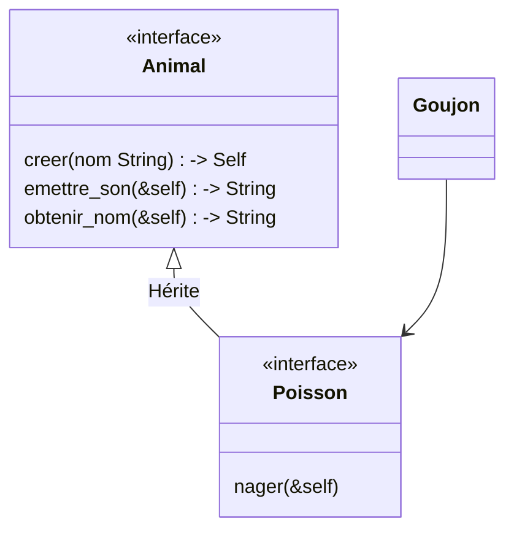

# Les traits en Rust

## Héritage de traits : 

```mermaid
classDiagram
    Animal <|-- Poisson : Hérite
    Goujon --> Poisson


    class Animal
    <<interface>> Animal
    Animal : creer(nom String) -> Self
    Animal : emettre_son(&self) -> String
    Animal : obtenir_nom(&self) -> String

    class Poisson
    <<interface>> Poisson
    Poisson : nager(&self)

    Class Goujon
```